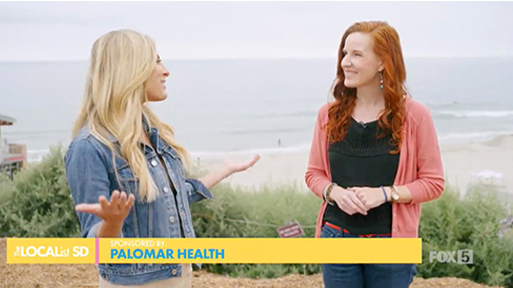
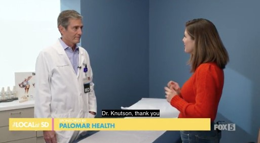
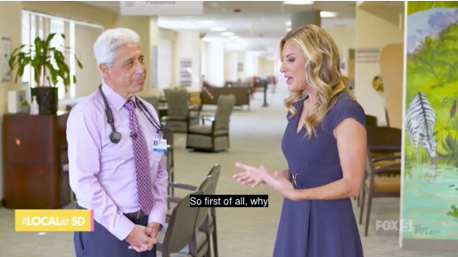

<!-- Loading Screen -->

    

        

        <h2 class="text-4xl font-semibold text-gray-900">Loading...</h2>
    

<head>
    <meta charset="UTF-8">
    <meta name="viewport" content="width=device-width, initial-scale=1.0">
    <title>MediPulse</title>
    
    
</head>
<body class="bg-gray-100 text-gray-900 relative">

 <!-- Background Animation -->

        

    

<!-- Welcome Section -->
 <section id="welcome" class="h-screen flex items-center justify-center text-center bg-gray-900 text-white">
        <h1 class="text-8xl font-extrabold fade-in">
            Welcome to MediPulse
        </h1>
    </section>

<!-- About Us Section -->
<section id="about" class="h-screen flex flex-col items-center justify-center text-center">
        <h2 class="text-7xl font-extrabold text-indigo-500 fade-in mb-6">About Us</h2>
        

            MediPulse is your next social media platform
        

    </section>

<!-- Our Mission Section -->
<section id="mission" class="h-screen flex flex-col items-center justify-center text-center bg-gray-200">
        
        <h3 class="text-6xl font-bold mt-8 text-gray-900 fade-in">Our Mission</h3>
        

            At MediPulse, we strive to create a community where social media lovers can collaborate, share, and support each other. From analyzing posts to providing improvements to your social media posts.
        

    </section>

 <!-- Featured Cars Section -->
 <section id="featured-vids" class="py-20 bg-gray-100">
        <h2 class="text-7xl font-bold text-center text-indigo-600 mb-10 fade-in">Featured Videos</h2>
            

                <a href="{{site.baseurl}}/gas" class="bg-white rounded-lg shadow-lg overflow-hidden transform transition-transform duration-500 hover:scale-105">
                    
                    

                        <h3 class="text-3xl font-bold mb-2">Meeting Dr. Peters</h3>
                        
 Interviewing Dr. Peters on effects of sunscreen.

                    

                </a>
                <a href="{{site.baseurl}}/electric" class="bg-white rounded-lg shadow-lg overflow-hidden transform transition-transform duration-500 hover:scale-105">
                    
                    

                        <h3 class="text-3xl font-bold mb-2">Meeting Dr. Knutson</h3>
                        
Interviewing Dr. Knutson on ground breaking discovery.

                    

                </a>
                <a href="{{site.baseurl}}/dream-car" class="bg-white rounded-lg shadow-lg overflow-hidden transform transition-transform duration-500 hover:scale-105">
                    
                    

                        <h3 class="text-3xl font-bold mb-2">Meeting Dr. Maltz</h3>
                        
Learn about how to choose a Primary physician.

                    

                </a>
            

    </section>

<!-- Testimonials Section -->
<section id="testimonials" class="py-20 bg-gray-900 text-white overflow-hidden">
    <h2 class="text-7xl font-bold text-center mb-10 fade-in">What Our Users Say</h2>
    

        

            <!-- Original Testimonials -->
            

                

                    "MediPulse is the 
                    best platform for phone enthusiasts! 
                    I've learned so much 
                    and connected with amazing people."
                

                <h3 class="mt-6 font-bold text-xl">- Alex R.</h3>
            

            

                

                    "A fantastic community where 
                    I can share my photography 
                    and get great feedback."
                

                <h3 class="mt-6 font-bold text-xl">- Jamie T.</h3>
            

            

                

                    "The forums have been super helpful 
                    for troubleshooting problems. 
                    Highly recommended!"
                

                <h3 class="mt-6 font-bold text-xl">- Chris M.</h3>
            

            

                

                    "I’ve found my dream platform 
                    thanks to the resources 
                    on this platform. 
                    Amazing work!"
                

                <h3 class="mt-6 font-bold text-xl">- Taylor L.</h3>
            

            

                

                    "This community has been incredible 
                    for finding advice on social media posts."
                

                <h3 class="mt-6 font-bold text-xl">- Morgan S.</h3>
            

            

                

                    "Every phone lover needs to join 
                    MediPulse. 
                    It’s a game-changer."
                

                <h3 class="mt-6 font-bold text-xl">- Riley D.</h3>
            

            <!-- Duplicate Testimonials for Infinite Scroll -->
            

                

                    "MediPulse is the 
                    best platform for phone adicts! 
                    I've learned so much 
                    and connected with amazing people."
                

                <h3 class="mt-6 font-bold text-xl">- Alex R.</h3>
            

            

                

                    "A fantastic community where 
                    I can share my social media photography 
                    and get great feedback."
                

                <h3 class="mt-6 font-bold text-xl">- Jamie T.</h3>
            

            

                

                    "The forums have been super helpful 
                    for troubleshooting social problems. 
                    Highly recommended!"
                

                <h3 class="mt-6 font-bold text-xl">- Chris M.</h3>
            

            

                

                    "I’ve found my dream post 
                    thanks to the resources 
                    on this platform. 
                    Amazing work!"
                

                <h3 class="mt-6 font-bold text-xl">- Taylor L.</h3>
            

            

                

                    "This website is tuff 
                    lowk recomend."
                

                <h3 class="mt-6 font-bold text-xl">- Morgan S.</h3>
            

            

                

                    "Every social media lover needs to join 
                    MediPulse. 
                    It’s a game-changer."
                

                <h3 class="mt-6 font-bold text-xl">- Riley D.</h3>
            

        

    

</section>

<!-- Call-to-Action Section -->
<section id="cta" class="h-screen flex flex-col items-center justify-center bg-gradient-to-r from-red-600 to-indigo-500 text-white">
        <h2 class="text-7xl font-bold mb-6 fade-in">Join the MediPulse Community</h2>
        

            Connect with phone enthusiasts from around the world, share your experiences, and explore amazing content about cars!
        

        <a href="{{site.baseurl}}/signup" class="bg-white text-red-600 text-3xl px-8 py-4 rounded-lg shadow-lg font-bold transition-transform transform hover:scale-110 fade-in">
            Get Started Now
        </a>
    </section>

 <!-- Footer -->
<footer class="bg-gray-800 text-white py-8">
        

            
&copy; 2024 MediPulse. All rights reserved.

            

                <a href="#" class="text-gray-400 hover:text-white mx-2">Facebook</a>
                <a href="#" class="text-gray-400 hover:text-white mx-2">Twitter</a>
                <a href="#" class="text-gray-400 hover:text-white mx-2">Instagram</a>
            

        

    </footer>

 <!-- JavaScript -->

 
</body>
</html>
